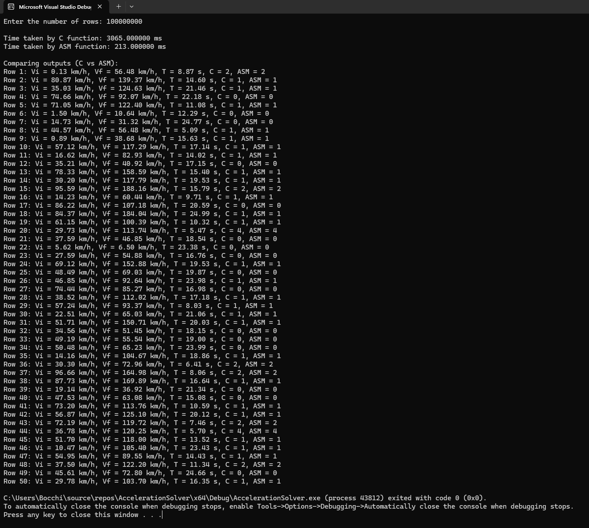

# AccelerationSolver
This project calculates acceleration using both C and x86-64 Assembly implementations. The program compares the performance of the two implementations, demonstrating the significant difference in execution time.

## Random Number Generation Range
The input values are generated using the following ranges:

- **Initial velocity** ($V_i$): 0 to 100 km/h
- **Final velocity** ($V_f$): $V_i$ to $V_i + 100$ km/h
- **Time** ($T$): 5 to 25 seconds

## PC Specifications
The program was executed on the following system configuration:
- **CPU**: Intel Core i7-13700K
- **RAM**: 32GB DDR5 5200 MT/s
- **Storage**: 2TB SSD with read/write speeds of 7000/5100 MB/s
- **Operating System**: Windows 11 Pro

The input size of 100,000,000 rows was used to observe a significant performance difference due to the high specifications of the PC.

## Execution Time Analysis

### Experiment Details
- **Number of Rows**: 100,000,000
- **Number of Runs**: 30 iterations

### Average Execution Times
- **Average Time for C Function**: 3069 ms
- **Average Time for ASM Function**: 216.9 ms

## Performance Analysis
The results indicate a substantial difference in performance between the C and Assembly implementations. The C implementation takes an average of **3069 ms**, while the Assembly implementation completes in **216.9 ms** on average. This demonstrates that the Assembly version is significantly more efficient, providing a faster execution time by approximately **14 times** compared to the C implementation.

## Program Output and Correctness Check

### Screenshot
A screenshot of the program output, showing the comparison of results between the C and Assembly implementations, is provided below to verify the correctness of the outputs.

Members:
Gan, Austin
Veracruz, Sean
